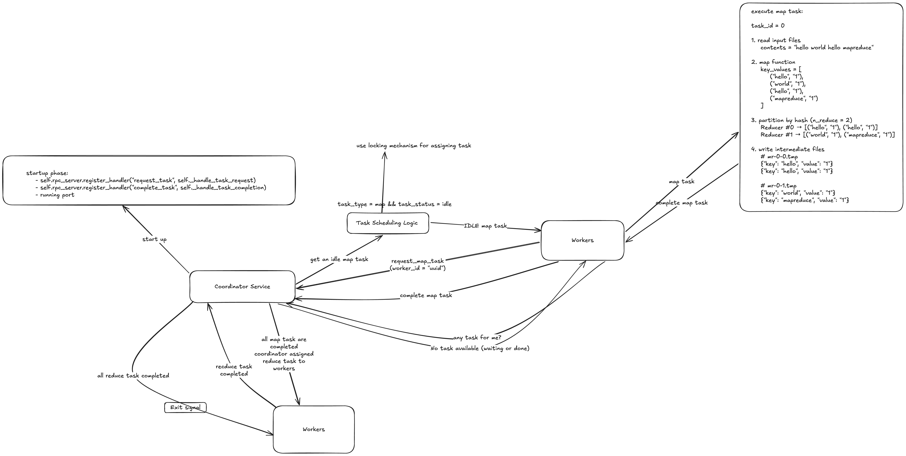

# Distributed MapReduce in Python

[](https://github.com/anle2024/Distributed-Map-Reduce-Application/actions)
[](https://www.python.org/downloads/)
[](https://opensource.org/licenses/MIT)
[](https://github.com/psf/black)

A Python implementation of the distributed MapReduce framework for processing large datasets across multiple worker processes. Features fault tolerance, automatic task reassignment, and pluggable applications.



## 🚀 Quick Start

### Option 1: Automated Demo

Run the complete demonstration with a single command:

```bash
python3 examples/demo.py
```

### Option 2: Manual Execution

```bash
# Start coordinator (in terminal 1)
./bin/mr-coordinator 2 input1.txt input2.txt

# Start workers (in separate terminals)
./bin/mr-worker apps/word_count.py
./bin/mr-worker apps/word_count.py
./bin/mr-worker apps/word_count.py
```

### Option 3: Using Installed Package

```bash
# Install the package
pip install -e .

# Start coordinator
mr-coordinator 2 input1.txt input2.txt

# Start workers
mr-worker apps/word_count.py
```

## 📋 Prerequisites

- Python 3.9 or higher
- pip package manager

## 🛠️ Installation

### Development Setup

```bash
# Clone the repository
git clone https://github.com/anle2024/Distributed-Map-Reduce-Application.git
cd Distributed-Map-Reduce-Application

# Create virtual environment (recommended)
python3 -m venv .venv
source .venv/bin/activate  # On Windows: .venv\Scripts\activate

# Install dependencies and package
pip install -e .
```

### Package Installation

```bash
pip install -e .
```

## 💻 Usage

### Basic Word Count Example

1. **Create input files:**

   ```bash
   echo "hello world hello python" > input1.txt
   echo "python is great world" > input2.txt
   ```

2. **Start the coordinator:**

   ```bash
   ./bin/mr-coordinator 2 input1.txt input2.txt
   ```

   - `2` = number of reduce tasks
   - `input1.txt input2.txt` = input files to process

3. **Start workers (in separate terminals):**

   ```bash
   ./bin/mr-worker apps/word_count.py
   ./bin/mr-worker apps/word_count.py
   ./bin/mr-worker apps/word_count.py
   ```

4. **Check results:**
   ```bash
   cat mr-out-*
   # Output:
   # hello 2
   # python 2
   # world 2
   # is 1
   # great 1
   ```

### System Architecture

The system consists of:

- **Coordinator**: Manages tasks and coordinates workers
- **Workers**: Execute map and reduce tasks
- **Applications**: Define how to process data (map/reduce functions)

**Data Flow:**

```
Input Files → Map Tasks → Intermediate Files → Reduce Tasks → Output Files
```

## 🔧 Creating Custom Applications

Create your own MapReduce application by implementing the `MapReduceApp` interface:

```python
# my_app.py
from mapreduce import MapReduceApp, KeyValue
from typing import List

class MyCountApp(MapReduceApp):
    def map_func(self, filename: str, contents: str) -> List[KeyValue]:
        # Count lines in each file
        lines = contents.count('\n')
        return [KeyValue(filename, str(lines))]

    def reduce_func(self, key: str, values: List[str]) -> str:
        # Sum all line counts for this file
        total = sum(int(v) for v in values)
        return str(total)

# Usage: ./bin/mr-worker my_app.py
```

## 🧪 Testing

### Run All Tests

```bash
python3 -m pytest tests/
```

### Run Specific Tests

```bash
# Basic functionality
python3 -m pytest tests/test_basic.py

# Parallel execution and fault tolerance
python3 -m pytest tests/test_parallel.py
```

### Test with Coverage

```bash
python3 -m pytest tests/ --cov=mapreduce --cov-report=html
```

## 🐛 Troubleshooting

### Common Issues

**1. "coordinator_info.txt not found"**

- Make sure coordinator is running before starting workers
- Check that coordinator started successfully (should print port number)

**2. "Import module not found"**

- Ensure you're running from the project root directory
- Check that the MapReduce application file exists

**3. Workers not getting tasks**

- Verify coordinator and workers are running in same directory
- Check coordinator logs for task assignment messages

**4. Tasks timing out**

- Default timeout is 10 seconds
- Check if input files are too large or map/reduce functions are too slow

### Debug Mode

Add print statements to see what's happening:

```python
# In your map/reduce functions
def map_func(self, filename: str, contents: str) -> List[KeyValue]:
    print(f"Processing {filename} with {len(contents)} characters")
    # ... your code
```

## 📁 Project Structure

```
distributed-mapreduce/
├── README.md                    # Usage guide (this file)
├── DESIGN_DOC.md               # System design and architecture
├── setup.py                    # Package installation
├── requirements.txt             # Dependencies
├── .gitignore                   # Git ignore patterns
├── src/mapreduce/              # Core implementation
│   ├── __init__.py
│   ├── coordinator.py          # Task coordination
│   ├── worker.py               # Task execution
│   ├── mapreduce.py            # Data structures
│   └── rpc_utils.py            # Network communication
├── apps/                       # MapReduce applications
│   ├── __init__.py
│   └── word_count.py           # Word counting example
├── bin/                        # Executable scripts
│   ├── mr-coordinator          # Coordinator entry point
│   └── mr-worker               # Worker entry point
├── tests/                      # Test suite
│   ├── test_basic.py           # Basic functionality tests
│   └── test_parallel.py        # Parallel and crash recovery tests
└── examples/                   # Usage examples
    └── demo.py                 # Complete working demonstration
```

## 📖 Documentation

- **[DESIGN_DOC.md](DESIGN_DOC.md)** - Comprehensive system design, architecture, and technical details
- **[examples/demo.py](examples/demo.py)** - Complete working example with explanations

## 🤝 Contributing

1. Fork the repository
2. Create a feature branch: `git checkout -b my-feature`
3. Make your changes and add tests
4. Run tests: `python3 -m pytest`
5. Commit: `git commit -m "Add my feature"`
6. Push: `git push origin my-feature`
7. Create a Pull Request

## 📄 License

This project is open source and available under the MIT License.

Run the complete demonstration with a single command:

```bash
# Run everything automatically
python examples/demo.py

# Or use the build script
./scripts/build.sh demo
```

This will create sample files, start the coordinator and workers, process the data, and show results.

### Option 2: Using Installed Package

If you've installed the package (see Installation section below):

```bash
# Start coordinator
mr-coordinator 2 input1.txt input2.txt input3.txt

# Start workers in separate terminals
mr-worker apps/word_count.py
mr-worker apps/word_count.py
mr-worker apps/word_count.py
```

### Option 3: Using Executable Scripts

```bash
# Start coordinator
./bin/mr-coordinator 2 input1.txt input2.txt input3.txt

# Start workers in separate terminals
./bin/mr-worker apps/word_count.py
./bin/mr-worker apps/word_count.py
./bin/mr-worker apps/word_count.py
```

### Option 4: Manual Setup

#### 1. Install Dependencies

```bash
pip install -r requirements.txt
```

#### 2. Create Test Files

Create some text files to process:

```bash
echo "hello world hello python" > input1.txt
echo "python programming world" > input2.txt
echo "hello again world wide web" > input3.txt
```

#### 3. Start the Coordinator

In one terminal, start the coordinator with the input files and number of reduce tasks:

```bash
python3 coordinator.py 3 input1.txt input2.txt input3.txt
```

The coordinator will:

- Create 3 map tasks (one per input file)
- Create 3 reduce tasks (as specified)
- Start an RPC server to communicate with workers
- Wait for workers to connect and complete tasks

#### 4. Start Workers

In separate terminals, start one or more workers:

```bash
# Terminal 2
python3 worker.py mrapps/word_count.py

# Terminal 3
python3 worker.py mrapps/word_count.py

# Terminal 4
python3 worker.py mrapps/word_count.py
```

Each worker will:

- Connect to the coordinator
- Request tasks from the coordinator
- Execute map/reduce operations
- Report completion back to coordinator

#### 5. View Results

After all tasks complete, the results will be in files named `mr-out-0`, `mr-out-1`, etc:

```bash
cat mr-out-* | sort
```

Expected output format:

```
again 1
hello 3
programming 1
python 2
web 2
wide 1
world 3
```

### Testing

Run the test suite to verify everything works:

```bash
# Quick tests
python3 test_runner.py

# Comprehensive tests (requires pytest)
pytest tests/ -v

# All tests using build script
./build.sh test
```

## Usage

### Coordinator

```bash
python coordinator.py <nReduce> <input_files...>
```

- `nReduce`: Number of reduce tasks to create
- `input_files`: One or more input files to process

### Worker

```bash
python worker.py <mapreduce_app>
```

- `mapreduce_app`: Path to Python file containing MapReduce application

## Creating Custom MapReduce Applications

To create a custom MapReduce application, inherit from `MapReduceApp` and implement the `map_func` and `reduce_func` methods:

```python
from mapreduce import MapReduceApp, KeyValue
from typing import List

class MyApp(MapReduceApp):
    def map_func(self, filename: str, contents: str) -> List[KeyValue]:
        """
        Process input and return key-value pairs.

        Args:
            filename: Input file name
            contents: File contents as string

        Returns:
            List of KeyValue objects
        """
        # Your map logic here
        return [KeyValue(key="example", value="1")]

    def reduce_func(self, key: str, values: List[str]) -> str:
        """
        Aggregate values for a key.

        Args:
            key: The key to reduce
            values: List of values for this key

        Returns:
            Reduced value as string
        """
        # Your reduce logic here
        return str(len(values))
```

## Architecture

### Coordinator

The coordinator (`coordinator.py`) manages the entire MapReduce job:

- **Task Management**: Creates map and reduce tasks, tracks their status
- **Worker Coordination**: Assigns tasks to workers via RPC
- **Failure Detection**: Monitors task timeouts and reassigns failed tasks
- **Phase Management**: Ensures reduce tasks don't start until all maps complete
- **Completion Tracking**: Determines when the entire job is finished

### Worker

Workers (`worker.py`) execute the actual map and reduce operations:

- **Task Execution**: Performs map/reduce operations using provided applications
- **File I/O**: Reads input files, writes intermediate and output files
- **Communication**: Requests tasks and reports completion via RPC
- **Error Handling**: Gracefully handles failures and reconnection

### RPC System

Custom RPC implementation (`rpc_utils.py`) handles coordinator-worker communication:

- **Simple Protocol**: JSON-based messages over TCP sockets
- **Reliability**: Timeouts and error handling for network issues
- **Concurrency**: Supports multiple simultaneous worker connections

### Data Structures

Core MapReduce abstractions (`mapreduce.py`):

- **Task**: Represents map/reduce work units
- **KeyValue**: Key-value pairs for map/reduce operations
- **File Utilities**: Functions for reading/writing intermediate files
- **Partitioning**: Hash-based key distribution for reduce tasks

## Testing

Run the test suite to verify functionality:

```bash
# Basic functionality tests
python -m pytest tests/test_basic.py -v

# Parallel execution and crash recovery tests
python -m pytest tests/test_parallel.py -v

# Run all tests
python -m pytest tests/ -v
```

Test coverage includes:

- Basic word count correctness
- Multiple worker parallel execution
- Worker crash recovery and task reassignment
- Empty file handling
- Map/reduce function unit tests

## Implementation Details

### File Naming Conventions

- **Intermediate files**: `mr-{map_task_id}-{reduce_task_id}`
- **Output files**: `mr-out-{reduce_task_id}`
- **Temporary files**: Use `.tmp` suffix with atomic rename

### Task Assignment

1. **Map Phase**: All map tasks must complete before reduce tasks begin
2. **Reduce Phase**: Reduce tasks can run in parallel once map phase is done
3. **Load Balancing**: Tasks assigned to workers on demand (pull model)

### Fault Tolerance

- **Timeout Detection**: Tasks that don't complete within 10 seconds are reassigned
- **Worker Failures**: Failed workers are automatically replaced
- **Atomic Operations**: File writes use temporary files with atomic renames
- **Idempotent Tasks**: Tasks can be safely re-executed

### Performance Considerations

- **Parallelism**: Multiple workers can process tasks simultaneously
- **I/O Efficiency**: Streaming file processing for large inputs
- **Memory Usage**: Intermediate data is written to disk, not kept in memory
- **Network Overhead**: Minimal RPC communication between coordinator and workers

## 🐛 Troubleshooting

### Common Issues

**1. "coordinator_info.txt not found"**

- Make sure coordinator is running before starting workers
- Check that coordinator started successfully (should print port number)

**2. "Import module not found"**

- Ensure you're running from the project root directory
- Check that the MapReduce application file exists

**3. Workers not getting tasks**

- Verify coordinator and workers are running in same directory
- Check coordinator logs for task assignment messages

**4. Tasks timing out**

- Default timeout is 10 seconds
- Check if input files are too large or map/reduce functions are too slow

### Debug Mode

Add print statements to see what's happening:

```python
# In your map/reduce functions
def map_func(self, filename: str, contents: str) -> List[KeyValue]:
    print(f"Processing {filename} with {len(contents)} characters")
    # ... your code
```

## References

- [MapReduce: Simplified Data Processing on Large Clusters](https://research.google.com/archive/mapreduce.html)
- [MIT 6.5840 Lab 1: MapReduce](https://pdos.csail.mit.edu/6.824/labs/lab-mr.html)
- [Distributed Systems Course Materials](https://pdos.csail.mit.edu/6.824/)
